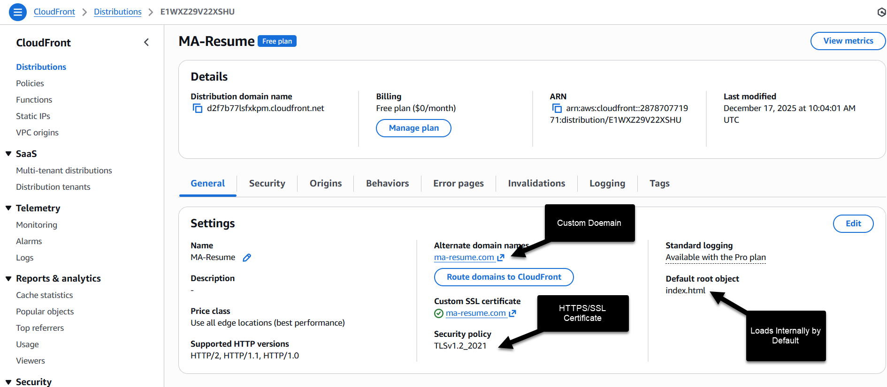
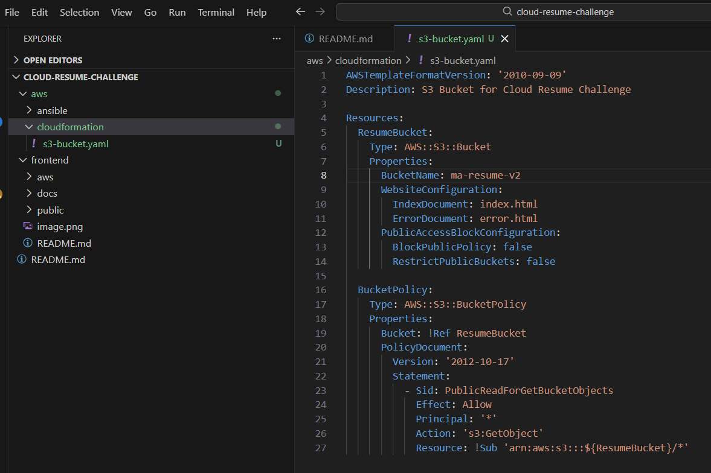
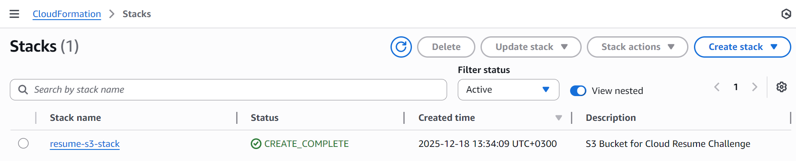
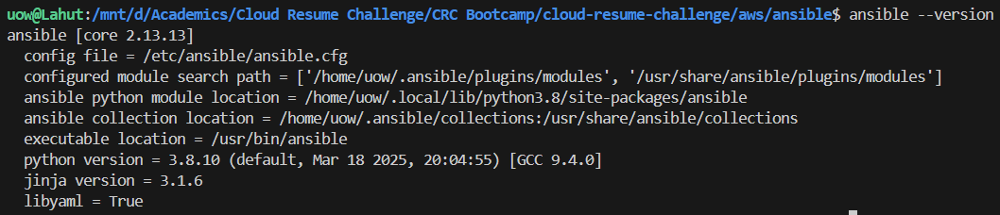
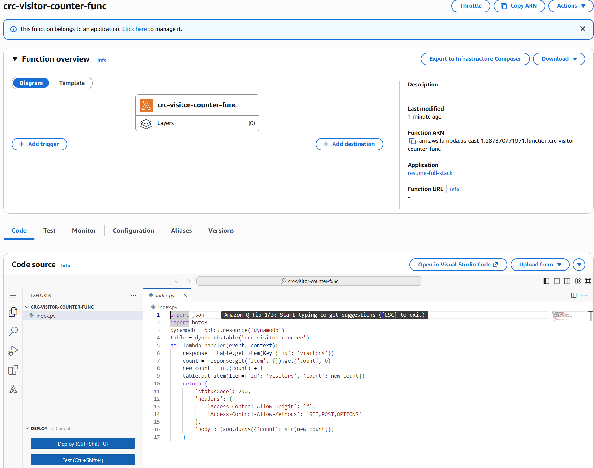
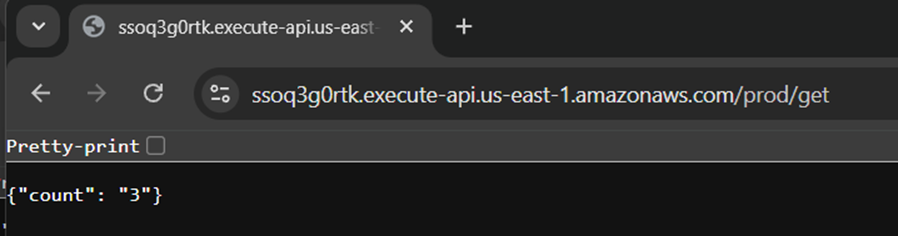

# AWS Infrastructure: Cloud Resume Challenge

This directory contains the **Infrastructure as Code (IaC)** and **Configuration Management** scripts used to deploy and manage the cloud environment.

## Project Summary
My primary focus was on the cloud implementation of this challenge. I wanted to get familiar with the AWS services and their implementation through **Infrastructure as Code (IaC)** and automation. Therefore, I used **Ansible** and **CloudFormation** to manage my entire stack. By automating the deployment of both the static website assets and the serverless visitor counter, I ensured a consistent and repeatable process for my cloud environment.

## Architecture

       +---------------------------------------+
       |           User Browser                |
       +---------------------------------------+
                 |             |
        (DNS)    |             | (HTTPS)
      Route 53 <-+             +-> CloudFront (CDN)
                                     |
                                     | (OAC Secure Access)
                                     v
                           +-----------------------+
                           | S3 Bucket (Frontend)  |
                           +-----------------------+
                                     |
                                     | (JS API Call)
                                     v
                           +-----------------------+
                           |     API Gateway       |
                           +-----------------------+
                                     |
                                     v
                           +-----------------------+
                           | Lambda (Python 3.12)  |
                           +-----------------------+
                                     |
                                     v
                           +-----------------------+
                           |  DynamoDB (Backend)   |
                           +-----------------------+

  Deployment: Managed via Ansible & CloudFormation (IaC)

## Overview
I built this cloud-native resume as part of a mission to master AWS deployment. My approach followed a three-phase evolution: 

### Phase 1: The "ClickOps" Discovery

I intentionally started by deploying my resume manually using the **AWS Management Console**. I wanted to experience firsthand how to navigate AWS services specifically configuring S3 buckets, managing granular permissions, and linking CloudFront distributions. By executing this "ClickOps" phase, I gained a visual understanding of the cloud architecture before attempting to automate it.

> **Manual Console Configuration**

Before automating, I validated the foundation by manually creating the ma-resume.com S3 bucket in the us-east-1 region. This screenshot confirms the bucket properties are correctly established to host my static assets and source code

I manually configured this CloudFront distribution to handle secure global delivery. By attaching a Custom SSL Certificate from ACM and mapping my Custom Domain (ma-resume.com), I ensured that the resume is accessible via HTTPS. I also set the Default Root Object to index.html so the site loads instantly upon visiting the domain.

---

## Phase 2. Infrastructure as Code (CloudFormation)
Once I had a working proof of concept live on the web, I transitioned to a semi-automated workflow by creating the **ma-resume-v2** bucket through CloudFormation. I chose this middle step to isolate and test my infrastructure scripts in a "sandbox" environment without risking the availability of my live manual site. This "split-brain" phase allowed me to verify that my CloudFormation templates and Ansible playbooks worked before I attempted to migrate my production DNS and CDN settings into code using the **ma-resume.com-v3** bucket in phase 3.

For phase 2, I used CloudFormation to define the skeletal infrastructure, ensuring the environment was reproducible and version-controlled. I wrote a YAML template that defined my bucket, configured it for static website hosting, and set up the necessary public read permissions.

### Key Resources
* **S3 Bucket:** Configured for static website hosting with a public read policy.
* **Stack Management:** Deployed via AWS CLI to track resource lifecycle.

**Template Definition**

### Deployment Execution
The stack was deployed using the following CLI command:
`aws cloudformation create-stack --stack-name resume-s3-stack --template-body file://s3-bucket.yaml`

> **Stack Creation Status**

## Automated Deployment (Ansible)
I didn't want to manually upload my files every time I made a change to my resume so I chose Ansible to handle my configuration management and deployment.

Since I am working on Windows, I set up WSL (Windows Subsystem for Linux) and installed Ansible there. I wrote a playbook called deploy-resume.yml that synchronizes my local frontend/ folder with my S3 bucket.

**Ansible Environment [WSL terminal output showing ansible --version]**

I ran the playbook from my WSL terminal. It used my CRC-bot credentials to securely talk to AWS and ensured my live site matches my local code.

**Successful Playbook Execution [Terminal output showing the PLAY RECAP with changed=X in yellow/green]**

**S3 Content Verification [S3 Bucket console showing the files and assets/folder uploaded by Ansible]**

---

## Phase 3. Transition to Full-Stack Automation (v3)
Since having half the project manual and half automated was not ideal for a professional workflow. I decided to consolidate everything, the S3 storage, the CloudFront CDN, and the Route 53 DNS records into a single CloudFormation template. This created the **ma-resume.com-v3** environment.

This step was important because it ensures that the entire stack is managed as code. If I need to deploy this to another account or region, the template handles the heavy lifting instead of me clicking through the console again.

**Handling Resource Conflicts**

During the deployment of the full-stack template, I ran into a challenge where the stack failed because the domain name was still tied to my manual CloudFront distribution. I had to manually release the CNAME from the old distribution and delete the existing Route 53 A record before the new stack could successfully claim them. Dealing with this taught me a lot about how AWS handles resource uniqueness and the importance of a clean environment when switching to IaC.

**Full-Stack CloudFormation Success This is the final status showing the successful creation of the entire infrastructure including the bucket, CDN, and DNS.**

## Phase 4. Serverless Backend & Visitor Counter
With the infrastructure fully automated, the final piece of the AWS puzzle was transforming the static resume into a dynamic application. I built a serverless backend to track and display live visitor telemetry.

This phase was particularly rewarding because it involved connecting the frontend to the backend through a secure, asynchronous loop.

### Backend Architecture
I expanded my single `main-infrastructure.yaml` CloudFormation template to include the entire backend stack, ensuring the database and logic are managed as part of the same lifecycle as the website storage.

* **Database (DynamoDB):** Created a NoSQL table with a "Pay-Per-Request" billing model to store the visitor count.
* **Logic (AWS Lambda):** Wrote a Python script using the `boto3` SDK to atomically increment the visitor count in DynamoDB.
* **API (API Gateway):** Deployed a REST API to serve as the "front door," allowing the public internet to securely trigger the Lambda function.

**DynamoDB Table Provisioning [Screenshot showing CREATE_COMPLETE for the VisitorCounterTable]**

### Logic & Integration
I used **JavaScript** on the frontend to perform an asynchronous `fetch` call to the **API Gateway** endpoint. This ensures the page loads instantly and the visitor count populates once the backend responds.

**Lambda Logic & Successful Test Execution**

**"Test" results in the Lambda console showing the "Succeeded" message and the JSON response.**

Verified the backend integration by triggering manual test events in the Lambda console. Successfully confirmed atomic increments in the DynamoDB table, validated by the JSON response payload.

**API Gateway Verification [Screenshot showing the JSON response in the browser]**

### Visual Polish
To ensure the visitor counter was prominent, I moved it outside the main white resume container and onto the wood-textured background. I styled it as a "stats badge" using CSS to match the professional aesthetic of the site's header.

**Final Live Production Site with Working Counter**

### Lifecycle Management & Security Patching
In December 2025, I performed a proactive security audit of the stack. After receiving an AWS Health notification regarding the deprecation of the Python 3.9 runtime, I executed the following environment upgrades:

* **Cloud Infrastructure:** Migrated the Lambda function runtime from `python3.9` to `python3.12` via CloudFormation. This ensures the backend remains within the AWS support window and receives critical security patches.
* **Local Development:** Upgraded the local automation environment from an EOL Python 3.8/Ansible 2.9 setup to a modern **Python 3.12** and **Ansible-core 2.20.1** stack managed via Miniconda. 

This maintenance cycle demonstrates the ability to manage technical debt and respond to lifecycle events in a production-grade cloud environment.

## Final Verification and Decommissioning
To prove that the new v3 bucket was actually serving the site, I performed a content change test. I modified my index.html locally, pushed it via Ansible to the v3 bucket, and invalidated the CloudFront cache. Once I confirmed the changes were live at https://ma-resume.com, I deleted the old ma-resume.com and ma-resume-v2 buckets. The site stayed up, confirming that the new automated stack is the sole source of truth.

**Clean Production Environment - This shows my S3 console after deleting the legacy buckets, leaving only the v3 bucket managed by CloudFormation.**

## Security & Authentication
Following AWS best practices, a dedicated **IAM User** named CRC-bot was created for programmatic access, avoiding the use of the root account.

### CLI Configuration
The development environment was authenticated using Access Keys and configured for the `us-east-1` region.

**IAM User Credentials**

**Identity Verification**

---

### Summary of Tech Stack
* **IaC:** AWS CloudFormation
* **Automation:** AWS CLI, Ansible
* **Identity:** AWS IAM
* **Storage:** Amazon S3
* **Database:** Amazon DynamoDB
* **Compute:** AWS Lambda (Python)
* **API:** Amazon API Gateway