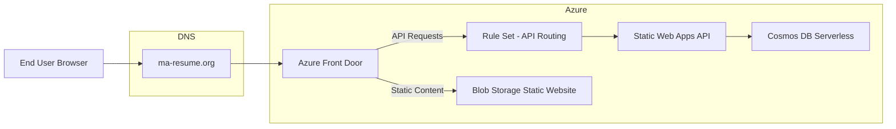
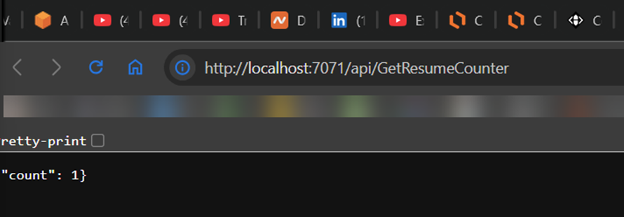
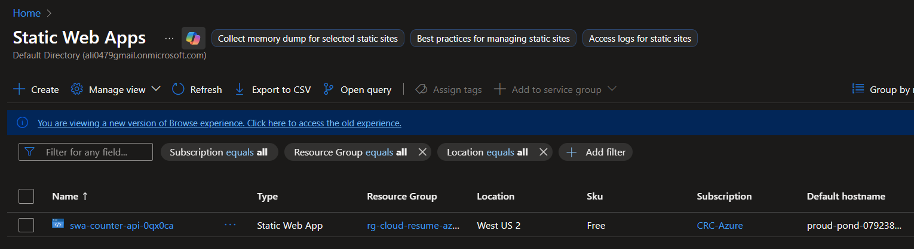
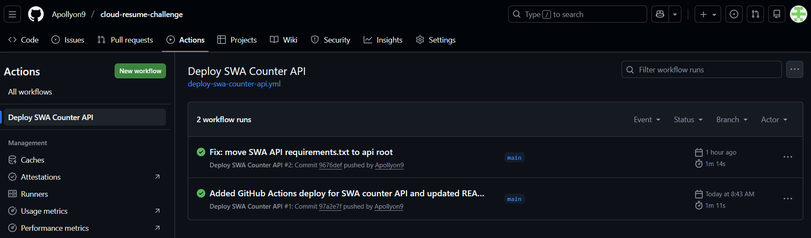
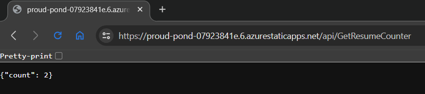
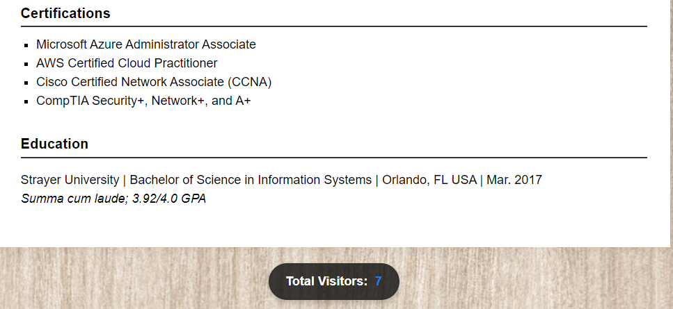
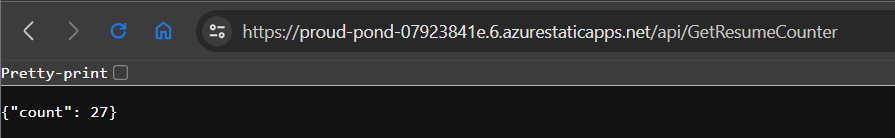
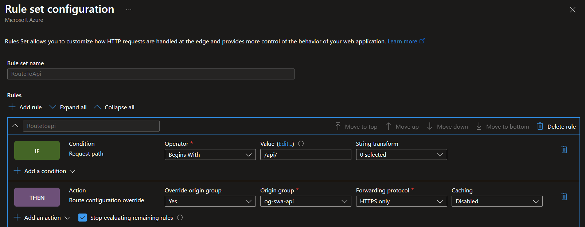
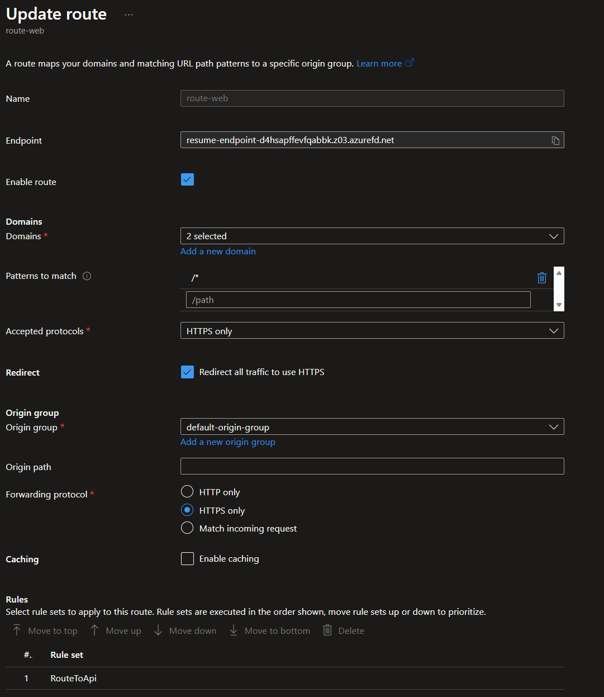
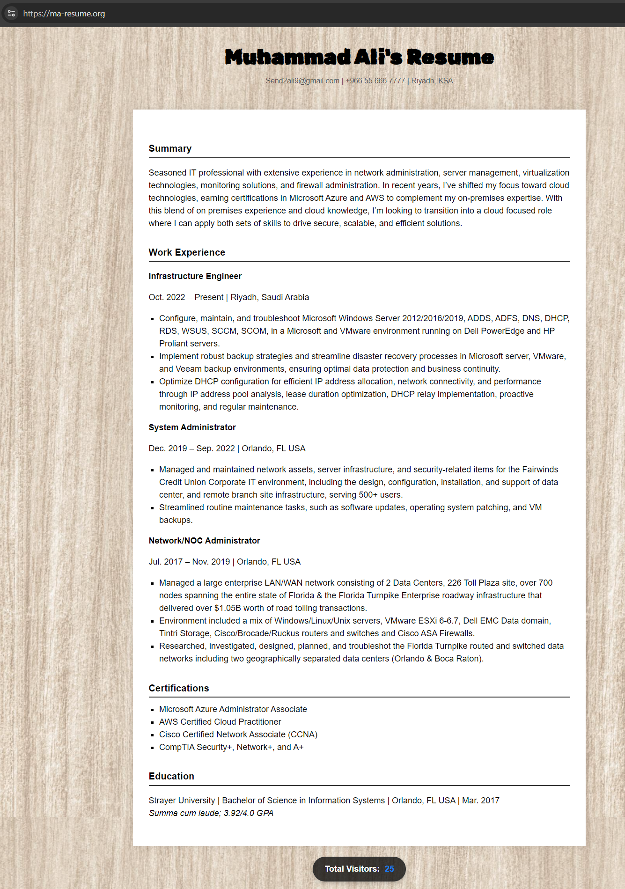

# Azure Infrastructure: Cloud Resume Challenge (Phase 3)

After successfully completing the AWS implementation, I am now transitioning to Microsoft Azure to build the second half of my multi-cloud resume. My goal for this phase is to automate the entire stack and follow professional DevSecOps practices as much as possible.

---

## Architecture Overview (Azure)

The following diagram illustrates the final Azure architecture after pivoting to Azure Static Web Apps for the backend API.



## The Game Plan
For this implementation, I am moving away from the manual "ClickOps" approach I used in the early days of AWS. Instead, I am building the following from scratch using code:
* **Frontend:** Azure Blob Storage (Static Website) served via **Azure Front Door** for CDN and HTTPS.
* **Backend:** A serverless **Azure Function** (Python) triggered by an API call.
* **Database:** **Cosmos DB** to store and sync the live visitor count.
* **IaC:** Full infrastructure automation using **Terraform**.

## Architectural Decisions: Why Terraform?
While **Bicep** is the native language for Azure, I decided to use **Terraform** for this phase. During my research and through feedback from peers, I noted that Bicep can occasionally present stability issues with certain resource providers. By choosing Terraform, I am ensuring a more reliable deployment while also demonstrating my ability to use a platform-agnostic tool that is the industry standard for multi-cloud environments.

## Identity & Security Setup
Before writing any infrastructure code, I had to solve a few authentication hurdles. My Azure account had several inactive tenants from previous courses (AZ104) that were blocked, so I had to explicitly target my **Default Directory** using the Azure CLI.

### Service Principal (The "Terraform-Bot")
Following the principle of least privilege, I didn't want Terraform using my personal login. I created a dedicated **Service Principal** named `terraform-bot` with 'Contributor' access to my subscription.

**Identity Verification**
To keep my credentials secure and out of my GitHub repository, I moved my IDs and Secrets into local environment variables:
* `ARM_CLIENT_ID`
* `ARM_CLIENT_SECRET`
* `ARM_SUBSCRIPTION_ID`
* `ARM_TENANT_ID`

This allows me to keep my `provider` block in Terraform clean and secure:
```hcl
provider "azurerm" {
  features {}
}
```
## Building the Foundation
The first step of the automation was creating the "container" for my project and the storage for the frontend.

### Resource Group
I created the `rg-cloud-resume-azure` in the `eastus` region to house all related resources.

### Storage Account (Frontend)
I used Terraform to provision a Standard LRS Storage Account. To ensure the name was globally unique, I integrated a `random_string` resource to append a 6-character suffix to the bucket name.

**Terraform Initialization & Apply**
After resolving a local installation issue with `winget`, I successfully initialized the environment and executed my first `apply`. 

Below is the output from my terminal confirming the creation of the storage account and the random suffix resource:


### Cloud Verification
To ensure the automation was successful, I verified the resources in the Azure Portal. The screenshot below shows the `stcloudresume0qx0ca` storage account successfully provisioned within the `rg-cloud-resume-azure` resource group in the `eastus` region.


### Frontend Deployment & Static Hosting
I enabled the **Static Website** feature on the Storage Account via Terraform and migrated the frontend assets. This included updating the placeholder state for the Azure transition and ensuring all asset paths remained relative to the root.

**Files Uploaded to $web Container:**
* `index.html` (Azure specific version)
* `styles.css` (Updated image paths)
* `images/background.jpg` (Images folder)

#### Deployment Verification
The terminal output below confirms the successful upload of the updated `styles.css` using the Azure CLI with the `--overwrite` flag:


#### Cloud Asset Storage
I verified that the assets are correctly structured within the `$web` container in the Azure Portal. Both the background image and the updated CSS are live:


#### Live Site Preview
The final result shows the resume successfully hosted on Azure with the wood-grain background rendered correctly. 

*Note: The visitor counter is currently utilizing the existing AWS backend API while the Azure Functions and Cosmos DB are being provisioned.*


### Backend: Cosmos DB Provisioning
I utilized Terraform to provision a **Cosmos DB SQL API** account using **Serverless** mode to optimize costs. This database will store the visitor count for the Azure-native version of the resume.

* **Database Name:** AzureResume
* **Container:** Counter
* **Partition Key:** /id

#### Database Verification
The screenshot below confirms the successful deployment of the Cosmos DB resources via Terraform:

**Cosmos DB Success**


## Initial Approach: Azure Functions + App Service Plan

My original design followed the standard Azure Functions model:

- Python Azure Function  
- HTTP trigger  
- Cosmos DB (serverless) for persistence  
- Infrastructure provisioned with Terraform  

I successfully:

- Provisioned the Resource Group, Storage Account, and Cosmos DB via Terraform  
- Created the Cosmos DB database and container  
- Implemented and tested the function logic locally using Azure Functions Core Tools  
- Verified that the function correctly incremented and returned the visitor count when run locally  

**Local Azure Function Success**  



---

## Blocking Issue: Azure Compute Quota Restrictions

When attempting to deploy the Function App to Azure, I encountered repeated deployment failures related to compute quotas.

Specifically:

- The Consumption Plan (Y1) failed due to a quota of **0 Dynamic VMs**  
- The Basic Plan (B1) also failed due to a quota of **0 Basic VMs**  
- Changing regions (East US → West US) did not resolve the issue  

These errors confirmed that the limitation was tied to my **subscription profile**, not a specific region.

---

## Architectural Pivot: Azure Static Web Apps API

To move forward without compromising the project goals, I pivoted to using **Azure Static Web Apps with a managed API backend**.

This approach still provides:

- A fully serverless HTTP API  
- Native Azure Functions under the hood (managed by Azure)  
- Seamless GitHub Actions integration  
- No requirement to provision App Service Plans (avoiding quota restrictions)  

**Static Web App Resource Created**  



---

## Infrastructure Changes (Terraform)

I updated my Terraform configuration to:

### Removed
- App Service Plan  
- Function App  
- Function storage account  

### Added
- Azure Static Web App (API-only)  

### Kept
- Blob Storage static website  
- Cosmos DB (serverless)  
- DNS configuration  

During this process:

- I imported the existing Cosmos DB container into Terraform state  
- Resolved region compatibility issues (`westus` → `westus2`) for Static Web Apps  
- Allowed Terraform to safely replace a tainted Storage Account  

---

## Terraform Output

```text
counter_api_default_host_name = "proud-pond-07923841e.6.azurestaticapps.net"
counter_api_deploy_token      = <sensitive>
website_url                  = https://stcloudresume0qx0ca.z22.web.core.windows.net/
```

---

## Static Web Apps API Deployment (GitHub Actions)

With the Azure Static Web App resource in place, I configured **GitHub Actions** to deploy the backend API automatically.

- Created a GitHub Actions workflow to deploy the Static Web Apps API
- Stored the deployment token securely using GitHub repository secrets
- Verified that the workflow successfully deployed both the `app` and `api` components

**GitHub Actions Deployment Successful**



---

## Backend API Validation (Live)

After deployment, I validated the backend API endpoint exposed by Azure Static Web Apps.

- The API endpoint successfully increments the visitor counter
- The response is returned in JSON format
- Data is persisted in Cosmos DB

**Live API Test**



## Frontend Integration (Azure Blob Storage)

The existing resume frontend was reused without layout or styling changes.

- HTML and CSS uploaded to Azure Blob Storage Static Website
- JavaScript updated to call the Azure Static Web Apps API
- Visitor counter increments correctly on page load

**Frontend Visitor Counter Working**




## Azure Front Door Integration & API Routing Resolution

To unify the frontend and backend under a single secure entry point, I placed **Azure Front Door** in front of both the Azure Blob Storage static website and the Azure Static Web Apps API. Front Door provides HTTPS, edge routing, and serves the custom domain `ma-resume.org`.

---

### Initial Routing Issue Encountered

After configuring Azure Front Door with path-based routing, I encountered an unexpected issue where requests to `/api/*` were being routed to the **Azure Blob Storage static website origin** instead of the **Azure Static Web Apps API**.

As a result, API requests returned the following error:

- HttpStatusCode: 404
- ErrorCode: WebContentNotFound


This error clearly indicated that Front Door was forwarding API traffic to Blob Storage rather than the intended backend API.

**API request returning Storage 404 via Front Door:**
```
The requested content does not exist.
HttpStatusCode: 404
ErrorCode: WebContentNotFound
RequestId : 060baa86-c01e-0000-33c6-792379000000
TimeStamp : 2025-12-30T19:55:22.4922683Z
```
---

### Validation of Backend API Health

To rule out backend issues, I tested the Azure Static Web Apps API directly using its default hostname. The API responded correctly and successfully incremented the visitor counter stored in Cosmos DB.

This confirmed that:
- The API logic was functioning correctly
- The issue was isolated to Front Door routing, not the backend

**Successful direct API call to Static Web Apps endpoint:**



---

### Root Cause Analysis

Although a dedicated `/api/*` route existed in Azure Front Door, Front Door consistently matched the catch-all `/*` route first and forwarded requests to the Blob Storage origin.

This demonstrated that **route specificity alone was not sufficient** to guarantee correct backend selection in this configuration.

---

### Deterministic Fix Using Azure Front Door Rule Sets

To resolve the issue in a deterministic and production-safe way, I implemented an **Azure Front Door Rule Set** to explicitly override routing behavior.

The rule performs the following logic:

- **Condition:** Request path begins with `/api/`
- **Action:** Override route configuration
- **Origin Group:** Azure Static Web Apps (`og-swa-api`)
- **Protocol:** HTTPS only
- **Behavior:** Stop evaluating remaining rules

This ensures that API traffic is always forwarded to the correct backend regardless of route matching order.

**Front Door Rule Set forcing `/api/*` traffic to SWA:**



---

### Rule Set Association with Frontend Route

The rule set is intentionally associated with the **catch-all frontend route (`/*`)**, allowing it to intercept API requests before they are forwarded to Blob Storage.

This guarantees clean separation of concerns while maintaining a single public domain.

**Rule Set attached to route-web (`/*`) in Front Door:**



---

### Final Verified Traffic Flow

With the rule set in place, routing behavior is now correct and deterministic:

- `https://ma-resume.org/` → Azure Blob Storage (static resume)
- `https://ma-resume.org/api/*` → Azure Static Web Apps API → Cosmos DB

The resume loads correctly, and the visitor counter increments reliably on each page load.

**Frontend (Blob Storage) working through custom domain:**



**Backend API working through custom domain (Front Door → SWA):**


### Summary of Tech Stack
* **IaC:** Terraform
* **Automation:** Terraform CLI, Azure CLI, GitHub Actions
* **Identity:** Azure Active Directory (Service Principal)
* **Edge / CDN / SSL:** Azure Front Door 
* **DNS:** Azure DNS
* **Storage:** Azure Blob Storage (Static Website)
* **Database:** Azure Cosmos DB (SQL API, Serverless)
* **Compute:** Azure Static Web Apps (Managed Functions – Python)
* **API:** Azure Static Web Apps API
