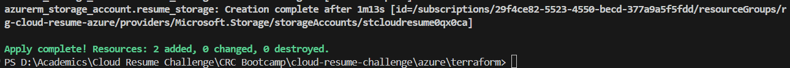
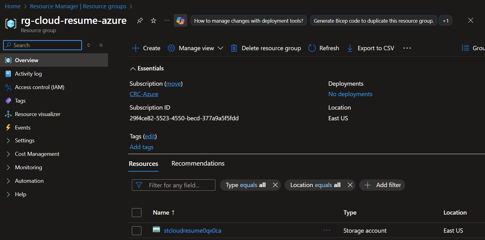
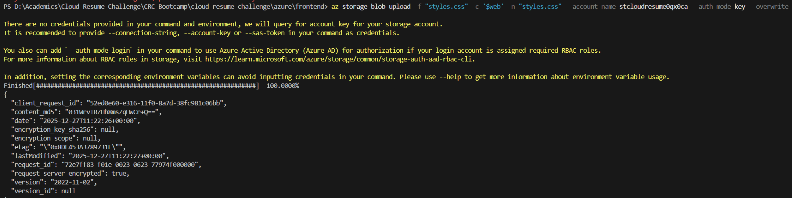
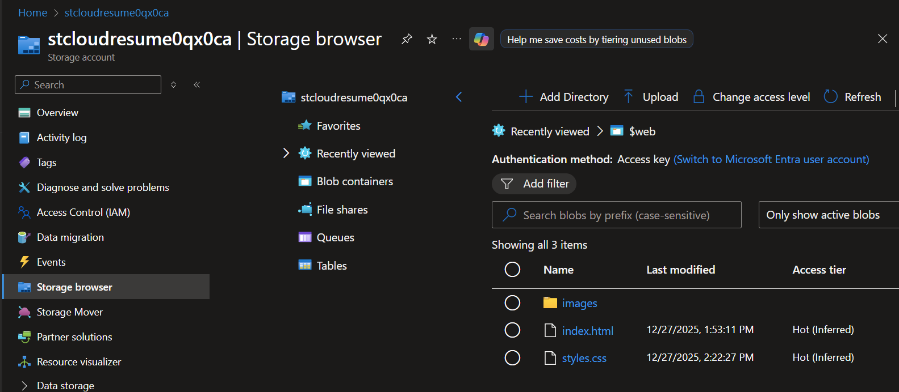
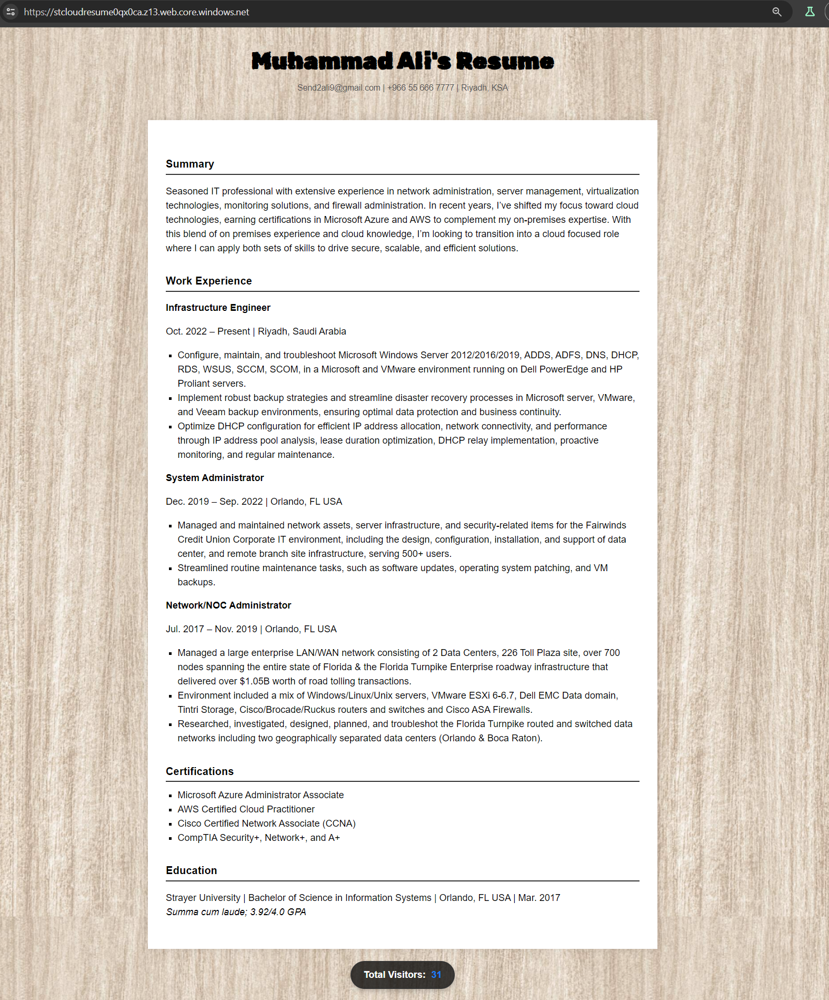
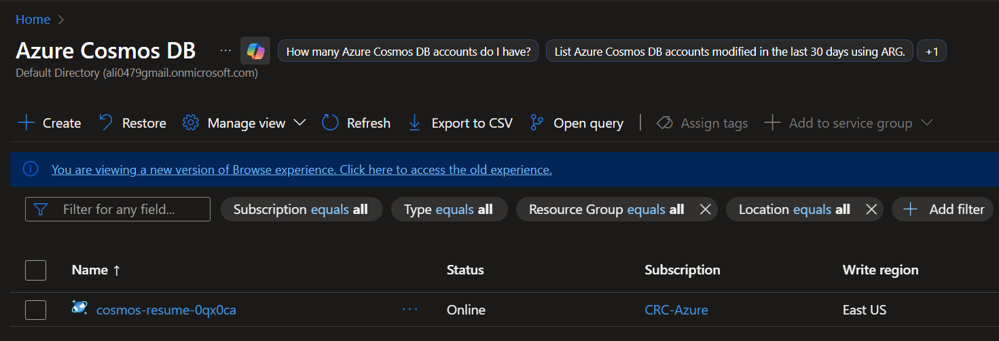

# Azure Infrastructure: Cloud Resume Challenge (Phase 3)

After successfully completing the AWS implementation, I am now transitioning to Microsoft Azure to build the second half of my multi-cloud resume. My goal for this phase is to automate the entire stack and follow professional DevSecOps practices as much as possible

## The Game Plan
For this implementation, I am moving away from the manual "ClickOps" approach I used in the early days of AWS. Instead, I am building the following from scratch using code:
* **Frontend:** Azure Blob Storage (Static Website) served via **Azure Front Door** for CDN and HTTPS.
* **Backend:** A serverless **Azure Function** (Python) triggered by an API call.
* **Database:** **Cosmos DB** to store and sync the live visitor count.
* **IaC:** Full infrastructure automation using **Terraform**.

## Architectural Decisions: Why Terraform?
While **Bicep** is the native language for Azure, I decided to use **Terraform** for this phase. During my research and through feedback from peers, I noted that Bicep can occasionally present stability issues with certain resource providers. By choosing Terraform, I am ensuring a more reliable deployment while also demonstrating my ability to use a platform-agnostic tool that is the industry standard for multi-cloud environments.

## Identity & Security Setup
Before writing any infrastructure code, I had to solve a few authentication hurdles. My Azure account had several inactive tenants from previous courses (AZ104) that were blocked, so I had to explicitly target my **Default Directory** using the Azure CLI.

### Service Principal (The "Terraform-Bot")
Following the principle of least privilege, I didn't want Terraform using my personal login. I created a dedicated **Service Principal** named `terraform-bot` with 'Contributor' access to my subscription.

**Identity Verification**
To keep my credentials secure and out of my GitHub repository—satisfying, I moved my IDs and Secrets into local environment variables:
* `ARM_CLIENT_ID`
* `ARM_CLIENT_SECRET`
* `ARM_SUBSCRIPTION_ID`
* `ARM_TENANT_ID`

This allows me to keep my `provider` block in Terraform clean and secure:
```hcl
provider "azurerm" {
  features {}
}
```
## Building the Foundation
The first step of the automation was creating the "container" for my project and the storage for the frontend.

### Resource Group
I created the `rg-cloud-resume-azure` in the `eastus` region to house all related resources.

### Storage Account (Frontend)
I used Terraform to provision a Standard LRS Storage Account. To ensure the name was globally unique, I integrated a `random_string` resource to append a 6-character suffix to the bucket name.

**Terraform Initialization & Apply**
After resolving a local installation issue with `winget`, I successfully initialized the environment and executed my first `apply`. 

Below is the output from my terminal confirming the creation of the storage account and the random suffix resource:



### Cloud Verification
To ensure the automation was successful, I verified the resources in the Azure Portal. The screenshot below shows the `stcloudresume0qx0ca` storage account successfully provisioned within the `rg-cloud-resume-azure` resource group in the `eastus` region.



### Frontend Deployment & Static Hosting
I enabled the **Static Website** feature on the Storage Account via Terraform and migrated the frontend assets. This included updating the placeholder state for the Azure transition and ensuring all asset paths remained relative to the root.

**Files Uploaded to $web Container:**
* `index.html` (Azure specific version)
* `styles.css` (Updated image paths)
* `images/background.jpg` (Images folder)

#### Deployment Verification
The terminal output below confirms the successful upload of the updated `styles.css` using the Azure CLI with the `--overwrite` flag:



#### Cloud Asset Storage
I verified that the assets are correctly structured within the `$web` container in the Azure Portal. Both the background image and the updated CSS are live:



#### Live Site Preview
The final result shows the resume successfully hosted on Azure with the wood-grain background rendered correctly. 

*Note: The visitor counter is currently utilizing the existing AWS backend API while the Azure Functions and Cosmos DB are being provisioned.*



### Backend: Cosmos DB Provisioning
I utilized Terraform to provision a **Cosmos DB SQL API** account using **Serverless** mode to optimize costs. This database will store the visitor count for the Azure-native version of the resume.

* **Database Name:** AzureResume
* **Container:** Counter
* **Partition Key:** /id

#### 📸 Database Verification
The screenshot below confirms the successful deployment of the Cosmos DB resources via Terraform:

