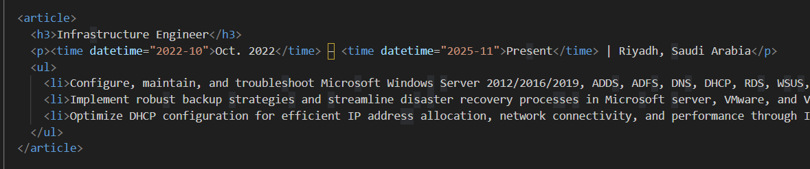

# Frontend Technical Specification

- Create a static website that serves an HTML resume.
- I am implementing an incremental approach defined by the instructor to minimize complexity and maximize learning.

---

To accelerate the initial step, I leveraged GenAI to generate the boilerplate HTML and basic CSS.
* **Tool Used:** [Microsoft Copilot]
* **Prompt:** `Convert this resume format into html. Please don't use a css framework. Please use the least amount of css tags`
* **Generated Output:** The initial output is stored in `./docs/Nov-26-2025-raw-resume-output.html` and will be manually refactored.

---

## Execution and Validation

### 1. Semantic Refactoring and Code Standards

The initial GenAI output was not suitable for production and required extensive manual restructuring to meet semantic and accessibility standards. This effort proves ownership over the generated code.

* **Semantic Structure:** The generic structure was replaced with high-value semantic tags: `<header>`, `<main>`, and `<section>`. Job entries were encapsulated within the **`<article>`** tag for clear semantic grouping.
* **Code Quality:** Applied technical standards including the **viewport** meta tag (for mobile scaling) and standardized all files to **two-space soft tabs**.

### 2. Validation and Technical Exploration

Running the refactored document through an HTML validator exposed specific semantic and structural issues, confirming the necessity of manual review over AI output alone. This addresses the core journaling requirement of documenting technical uncertainty:

* **Issue A: Articles Lacking Headings**
    * **Problem:** The validator flagged the job `<article>` tags for lacking a direct heading. This is a critical semantic and accessibility failure.
    * **Resolution:** The job title tag was converted to an **`<h3>`** heading within the `<article>`, ensuring all content blocks are correctly structured.
* **Issue B: ISO 8601 Date Format Error**
    * **Problem:** The **`<time>`** tag lacked the required machine-readable date in the `datetime` attribute (ISO 8601 format).
    * **Resolution:** The missing `datetime` attribute was added to all job dates (e.g., `<time datetime="2022-10-01">`) to resolve the error and finalize semantic accuracy.

---

## Technical and Structural Adjustments

The following standardization decisions were made to align with modern web best practices and the overall project goals:

* **File Structure:** Created `docs` (for raw output) and `public` (for final production files) within the frontend directory.
* **Semantic Structure:** For the upcoming refactor, the content will be structured using semantic HTML tags: `<header>`, `<main>`, and `<section>` to ensure clarity and accessibility 

[Images of semantic HTML tags]

* **Code Standards:** Using UTF-8, adding the `viewport` meta tag for mobile scaling, and standardizing on **two-space soft tabs**.

---

## Local Server Setup and Basic Layout

### 1. CSS Externalization and Local Serving

The embedded styling was moved into a separate external stylesheet (`styles.css`) to improve code cleanliness and maintainability.

* **Local Server:** Used `npx http-server` to run a static server, allowing for real-time testing of the external CSS link.
* **Layout Implementation:** Applied foundational layout rules to the `<main>` element (`max-width: 800px;` and `margin: 0 auto;`) to center the content on the screen. The `<header>` was also centered and visually separated to enhance professionalism.
* **Troubleshooting:** Resolved local caching issues using "Hard Reload" (`Ctrl + Shift + R`) and the **Disable cache** option in DevTools, ensuring immediate visual confirmation of CSS changes.

---